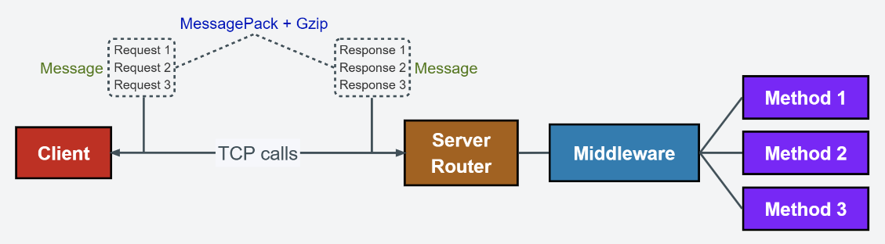

# ComboRPC

## 基于TCP + MessagePack的简易RPC框架，支持单个请求调用多个方法，支持自定义中间件、自定义负载均衡，支持广播服务。



***

## 导入包

```
go get github.com/dpwgc/comborpc
```

```
import "github.com/dpwgc/comborpc"
```

***

## 服务端-使用说明

### 路由启动

```
func demoServe() {

    // 新建路由
    router := comborpc.NewRouter(comborpc.RouterOptions{
        Endpoint:    "0.0.0.0:8001",
    })

    // 添加中间件
    router.AddMiddleware(testMiddleware)

    // 添加方法
    router.AddMethod("testMethod", testMethod)
    // router.AddMethod("testMethod1", testMethod1)
    // router.AddMethod("testMethod2", testMethod2)

    // 启动路由
    router.Run()
}
```

* `comborpc.Router`: 服务路由结构体
  * `AddMethod`: 添加方法
  * `AddMiddleware`: 添加中间件
  * `AddMiddlewares`: 添加多个中间件
  * `Run`: 启动路由监听服务
  * `Close`: 关闭路由监听服务


* `comborpc.RouterOptions`: 路由设置结构体
  * `Endpoint`: 服务端地址
  * `QueueLen`: 连接队列长度
  * `MaxGoroutine`: 最大协程数量
  * `Timeout`: 请求超时时间

### 方法`Method`编写示例

```
// 方法
func testMethod(ctx *comborpc.Context) {
    
    // 将请求数据绑定在request对象上
    request := TestRequest{}
    ctx.Bind(&request)
    
    // 打印请求体
    fmt.Println("testMethod1 request:", "A1:", request.A1, "A2:", request.A2, "A3:", request.A3)
    
    // 返回数据给客户端
    ctx.Write(TestResponse{
        Code: 200,
        Msg:  "ok",
    })
}

// 请求体
type TestRequest struct {
    A1 string
    A2 int64
    A3 float64
}

// 响应体
type TestResponse struct {
    Code int
    Msg  string
}
```

### 中间件`Middleware`编写示例

```
// 中间件
func testMiddleware(ctx *comborpc.Context) {
    fmt.Println("start")
    ctx.Next()
    fmt.Println("end")
}
```

* `comborpc.Context`: 方法上下文结构体
  * `Bind`: 将请求数据解析并绑定在指定结构体上
  * `Read`: 直接读取请求体（经过msgpack序列化的字节数组）
  * `Write`: 编写响应体
  * `RemoteAddr`: 客户端ip地址
  * `LocalAddr`: 本地ip地址
  * `CallMethod`: 当前被客户端调用的方法名
  * `CustomCache`: 用户自定义上下文缓存
  * `Next`: 进入下一个方法（中间件相关）
  * `Abort`: 停止继续执行下一个方法（中间件相关）

***

## 客户端-使用说明

### 使用`comborpc.SingleCall`发送单一请求，一次请求只调用一个方法，返回一个`comborpc.Response`对象

```
func demoSingleRequest() {
  
  // 接收响应结果的结构体
  responseBind := TestResponse{}

  // 构建并发送请求，同时将响应结果绑定到responseBind对象上
  comborpc.NewSingleCall(comborpc.CallOptions{
      Endpoints: []string{"0.0.0.0:8001"},
  }).SetRequest("testMethod", TestRequest{
      A1: "hello world 3",
      A2: 1003,
      A3: 54.1,
  }).DoAndBind(&responseBind)

  // 打印响应结果
  fmt.Println("single response:", "code:", responseBind.Code, "msg:", responseBind.Msg)
}
```

### 使用`comborpc.ComboCall`发送组合请求，一次请求同时调用两个方法，返回一个`comborpc.Response`数组

```
func demoComboRequest() {

  // 构建并发送请求
  responseList, _ := comborpc.NewComboCall(comborpc.CallOptions{
      Endpoints: []string{"0.0.0.0:8001"},
  }).AddRequest("testMethod1", TestRequest{
      A1: "hello world 1",
      A2: 1001,
      A3: 89.2,
  }).AddRequest("testMethod2", TestRequest{
      A1: "hello world 2",
      A2: 1002,
      A3: 67.5,
  }).Do()
	
  // 遍历响应列表
  for _, response := range responseList {
  
      // 将响应列表的每个子项数据绑定到responseBind对象上
      responseBind := TestResponse{}
      response.Bind(&responseBind)
		
      // 打印每个响应结果
      fmt.Println("combo response item:", "code:", responseBind.Code, "msg:", responseBind.Msg)
  }
}
```

* `comborpc.ComboCall`: 组合调用结构体
  * `AddRequest`: 添加请求体
  * `Do`: 执行请求
  * `Broadcast`: 广播请求（给所有服务端地址发送请求）


* `comborpc.SingleCall`: 单一调用结构体
  * `SetRequest`: 设置请求体
  * `Do`: 执行请求
  * `DoAndBind`: 执行请求，并将响应数据绑定到指定结构体上
  * `Broadcast`: 广播请求（给所有服务端地址发送请求）


* `comborpc.CallOptions`: 调用参数结构体
  * `Endpoints`: 服务端地址列表
  * `Timeout`: 请求超时时间
  * `LoadBalance`: 自定义负载均衡方法


* `comborpc.Response`: 响应结构体
  * `Bind`: 将响应数据解析并绑定在指定结构体上
  * `Success`: 判断是否响应成功

### 自定义负载均衡器`LoadBalance`

#### 自定义负载均衡方法编写（样例）
```
// 随机负载均衡处理方法
func deomLoadBalance(endpoints []string) string {
    if len(endpoints) == 0 {
        return ""
    }
    // 随机负载均衡策略
    rand.Seed(time.Now().Unix())
    return endpoints[rand.Intn(len(endpoints))]
}
```

#### 在调用`NewComboCall`/`NewSingleCall`时设置自定义负载均衡方法

```
comborpc.NewComboCall(comborpc.CallOptions{
    Endpoints: []string{"0.0.0.0:8001"},
    LoadBalance: deomLoadBalance, //自定义负载均衡方法
})
```